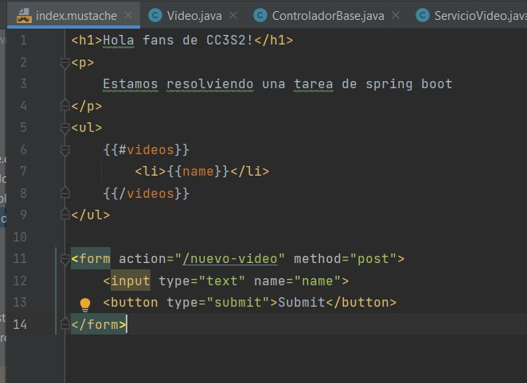

# PC5-CC3S2

## Pregunta 2

### Metodo 1

Primero creamos una carpeta llamada "files" donde pondremos los archivos
default.conf , nginx.conf, html.tar.gz y el Dockerfile lo creamos fuera de la carpeta
 y ejecutamos el comando "docker build -t docker-example ."

Luego verificamos que la imagen se ha creado usando docker images

Ahora lanzamos un contenedor con la imagen que hemos creado y comprobamos que se esta ejecutando

Ahora abrimos localhost:8080 en el navegador

Ejecutamos los siguiente comandos

Detenemos y eliminamos los contenedores que lanzamos

### Metodo 2

Descargaremos la imagen con el siguiente comando "docker image pull alpine:lastest"

Luego ejecutamos el contenedor en primer plano usando "-it", y ejecutamos los siguientes comandos

Luego guardamos el contenedor

### Metodo 3

Descargamos 

Creamos el Dockerfile

Construimos la imagen

Comparamos el tamaño de la imagen

Ahora la probamos, pero primero detenemos y eliminamos el anterior contenedor alpine-test

Luego la probamos y verificamos usando el comando "cat /etc/*release"

## Pregunta 3

Pregunta 1

Agregando mustache

Pregunta 2

Creamos el index.mustache

Ejecutamos y nos dirigimos a localhost:8080 en el navegador

Ajustamos el ControladorBase

Editamos el index.mustache

Pregunta 3

Ejecutamos y vamos a localhost:8080 en el navegador

Pregunta 4

Creamos la clase Video.java

Pregunta 5

Creamos VideoService.java

Pregunta 6

Pregunta 7 y 8

Pregunta 9

## Pregunta 4

La automatización de infraestructura en la arquitectura de microservicios se refiere 
a utilizar herramientas y procesos automatizados para administrar y desplegar la 
infraestructura necesaria para ejecutar y hacer crecer los microservicios.
Imaginemos que tenemos una aplicación que consta de diferentes partes, microservicios, 
cada uno con su propia función específica, cada microservicio se ejecuta en su propio 
entorno, como un servidor o una instancia de base de datos. 
La automatización de infraestructura permite gestionar de manera eficiente y consistente 
estos diferentes entornos.
La implementación automatizada es uno de los aspectos clave de la automatización de 
infraestructura ya que significa que se pueden usar herramientas y scripts para 
desplegar y configurar automáticamente los microservicios en sus respectivos entornos. 
Esto evita tener que hacer estas tareas manualmente, lo que puede generar errores 
y consumir mucho tiempo.
La automatización de infraestructura tambien permite escalar automáticamente los recursos 
según sea necesario. Esto significa que podemos agregar o eliminar servidores o 
bases de datos de forma dinámica sin tener que hacerlo manualmente. 
De esta manera podemos asegurarnos de que nuestros microservicios tengan suficientes 
recursos para manejar la carga de trabajo sin problemas.
Ahora, como es que la automatización de infraestructura se relaciona con los componentes 
de la arquitectura?
1. Componentización a través de servicios: La automatización de infraestructura permite 
crear y gestionar servicios independientes de manera eficiente y consistente.
2. Organización en torno a capacidades comerciales: La automatización de infraestructura 
facilita la gestión descentralizada de la infraestructura para cada servicio, 
lo que permite la autonomía de los equipos.
3.  Productos en lugar de proyectos: Apoya el enfoque de mantener los servicios 
como productos a lo largo de su ciclo de vida completo, lo que implica la responsabilidad 
completa del equipo de desarrollo en la construcción y operación de los servicios.
4. Terminales inteligentes y canalizaciones simples: Ayuda a configurar 
y gestionar los puntos finales de comunicación entre los servicios, 
lo que garantiza una comunicación eficiente y confiable mediante el uso de 
protocolos simples.
5. Gobierno descentralizado: Permite a los 
equipos de desarrollo elegir las tecnologías y herramientas más adecuadas para sus 
servicios, lo que fomenta la autonomía y la flexibilidad en la toma de decisiones.
6. Gestión descentralizada de datos: Facilita la gestión independiente de la 
infraestructura de datos para cada servicio, lo que permite el uso de diferentes 
bases de datos y tecnologías de almacenamiento según las necesidades de cada servicio.

